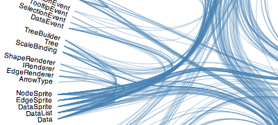
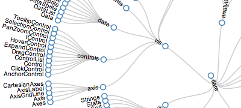

# Chapter 12 Layout

Layouts can be understood as 'functions for making common graphs'. It is much more convenient to plot a variety of complex graphs with layout.

## What is layout

Literally, 'layout' seems to have the meaning that 'deciding where to plot what kinds of elements'. Layout is a very significant concept in D3. Compared with other visualization tools, D3 is not that user&beginner friendly. But once mastered, it is more handy and convenient than other tools. The picture below shows the differences between D3 and other visualization tools. 

We can see that there are relatively more procedures of D3, which is not convenient for beginners to understand. However, the advantages are that it can help us to build more sophisticated graphs. As a result, now we can define when to choose D3 is better.  

- Select D3: If you want to develop any imaginary chart in your mind. 
- Select Highcharts, Echarts and etc.: If you want to develop some popularized charts with certain species. 
It seems that D3 is provided for artists or enthusiasts, but beginners do not need to feel frustrated also.

## How to understand the layout

From the picture above we can conclude that the usage of layout is to make**data not suitable for plotting**convert to**data suitable for plotting**.

Therefore, in order to make it easier to be understanded, we will explain the function of layout as: **Data Conversion**.

## What are the results

In all, D3 provides 12 kinds of layout, which are: Pie, Force, Chord, Tree, Cluster, Bundle, Pack, Histogram, Partition, Stack, Treemap, Hierarchy. 

In the 12 layouts, hierarchy can not be used straightforwardly. Cluster, Pack, Partition, Tree, and Treemap are extended from Hierarchy. As a result, there are 11 layouts can be used (5 are extended from Hierarchy). The function of these layouts is to transform one kind of data to another kind of data, and the data after conversion is more convenient to be visualized compared with the original data. 

### Bundle

### Chord 

### Cluster 

### Force 

### Histogram  

### Pack 

### Partition  

### Pie 

### Stack  

### Tree 

### Treemap 

