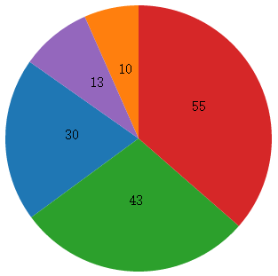

# Chapter 13 Making Pie Charts

In this chapter, we will make a pie chart. In the application of layout, the easiest one is pie charts. Through this article you will have a preliminary understanding of layout.



## Data

We have the following data needing to be visualized:

```javascript
var dataset = [ 30 , 10 , 43 , 55 , 13 ];
```

This kind of data can not be drawn directly. For example, if we want to draw a section of pie chart, we need to know the starting angle and ending angle if an arc, but these values are not included in the dataset. Therefore, we need to consider about layout. The function of layout is to: 

**Calculate the data suitable for drawing.**

During this process, we will call it as 'data conversion' in this tutorial for ease of understanding.

## layout (data conversion)

Define a layout,

```javascript
var pie = d3.layout.pie();
```

The return value is assigned to the variable pie and pie can be used as a function at this time.

```javascript
var piedata = pie(dataset);
```

We regard the array dataset as a parameter of pie(), return its value to piedata. So in this way,

**piedata is the converted data**

It's very easy and veyr simple to make it. Now we can output piedata in the console, and observe what was data converted into.


As shown above, 5 integers are tranformed to 5 objects, and every object has variables **startAngle**and**endAngle**, and**raw data (attribute name is data)**. All of these are data needed for drafting.

What should be remembered here is: **Layout is not to draw a graph directly, but to gain data needed for drafting**。

## Drawing graphics

In order to plot according to converted data piedata, we still need a tool: generator.

SVG has an element called path, which is the most powerful element in SVG, can represent any other graphics. Just as its name suggests，the path element draws varieties of graphics by means of defining a path. However, path is very hard to be calculated, the data obtained from layout conversion -- piedata is still very difficult to be calculated mannually to gain the path value. Something help us to accomplish this assignment is**generator**。

The generator utilized here is **arc generator**, which is capable to generate arc path, since every part of a pie chart is an arc. 

```javascript
var outerRadius = 150; //Outer radious
var innerRadius = 0; //Inner radious; If it is 0 then there is no blank inside

var arc = d3.svg.arc()  //arc generator
    .innerRadius(innerRadius)   //Set the inner radius
    .outerRadius(outerRadius);  //Set the outer radius
```

The results returned from arc generator are assigned to 'arc'. At this moment, 'arc' can be applied as a function, which means if the piedata is inputed as a parameter, the path value can be gained.

After finishing the procedures above, we can settle down to add graphic elements to SVG. Firstly, we add a sufficient quantity (5) of grouping elements (g) to svg, and each group is to store the related elements of an arc. 

```javascript
var arcs = svg.selectAll("g")
    .data(piedata)
    .enter()
    .append("g")
    .attr("transform","translate("+ (width/2) +","+ (width/2) +")");
```

Then we add path to each g element:

```javascript
arcs.append("path")
    .attr("fill",function(d,i){
        return color(i);
    })
    .attr("d",function(d){
        return arc(d);   //Call arc generator to get the path value
    });
```

Because 'arcs' is a selection set selecting 5 g elements simultaneously, after calling append(“path”), there is a g element inside each path. The attribute name of path value is d, the return value after calling arc generator is assigned to it. We need to be cautious that the parameter d of arc(d) is the bound data.

Additionally, color is a color scale, which can obtain corresponding color value according to the incoming index number. We define the color scale as follows:

```javascript
var color = d3.scale.category10();   //A color scale has 10 colors.
```

Then we can add texts at the center of each arc.

```javascript
arcs.append("text")
    .attr("transform",function(d){
        return "translate(" + arc.centroid(d) + ")";
    })
    .attr("text-anchor","middle")
    .text(function(d){
        return d.data;
    });
```

Arc.centroid(d) can calculate the center of an arc. Be careful, the returned value inside text() is d.data, but not d. Because the bound data is object, which includes d.startAngle, d.endAngle, d.data and etc. Among them, d.data is the value of integer before conversion.

## Source Code

Download link：[rm80.zip](http://www.ourd3js.com/src/rm/rm91.zip)

Presentation link：[http://www.ourd3js.com/demo/rm/R-9.1/pie.html](http://www.ourd3js.com/demo/rm/R-9.1/pie.html)
