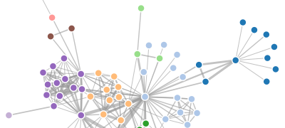
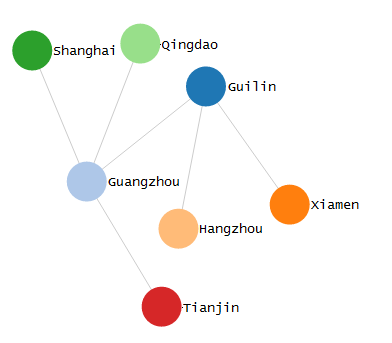

# Chapter 14 Force-Directed Graph

Force-Directed Graph, is a kind of graphic algorithm. There are some nodes configued in a 2-dimension or 3-dimension space, and connected with links, which are called edges. The length of each edge is almost equal, and the edges try not to intersect with each other as much as possible. Both the nodes and edges are exerted force, and the force is calculated on the ground of the relative positions of nodes and edges. According to the role of force, the motion tracks of nodes and edges are calculated, and the energy of the whole graph is decreased as much as possible until it reachs a stable state with low energy. 



Force-directed graphs can represent many-to-many relationships between nodes.

## Data

Original data are as follows:

```javascript
var nodes = [ { name: "Guilin" }, { name: "Guangzhou" },
              { name: "Xiamen" }, { name: "Hangzhou" },
              { name: "Shanghai" }, { name: "Qingdao" },
              { name: "Tianjin" } ];
 
 var edges = [ { source : 0 , target: 1 } , { source : 0 , target: 2 } ,
               { source : 0 , target: 3 } , { source : 1 , target: 4 } ,
               { source : 1 , target: 5 } , { source : 1 , target: 6 } ];
```

They are arrays of nodes and edges. Nodes are the city names, and the both ends of edges are the serial numbers of nodes(Serial numbers begin from 0).

These data can not be used to plot, because the coordinates of nodes and edges are unknown. This condition reminds us of layout. The lay out we want to use in this chapter is: **d3.layout.force()**.

## Layout(data conversion)

We can define a Force-Directed Graph as follows:

```javascript
var force = d3.layout.force()
      .nodes(nodes) //Specify an array of nodes
      .links(edges) //Specify an array of edges
      .size([width,height]) //Specify the scope range
      .linkDistance(150) //Specify the length of link
      .charge([-400]); //Mutual force
```

Then, make force become effective:

```javascript
force.start();    //Begin to work
```

In this way, data of array nodes and edges have both changed. We can output it in the console and observe what happens. 

```javascript
console.log(nodes);
console.log(edges);
```

The following figure shows the comparison between cases before and after node conversion.


After conversion, there are more variables in the node object. Their significances are as follows:

- index: index of the node
- px, py: The node coordinates of the last moment
- x, y: the current coordinates of the node
- weight: weight of the node

Let's take a look at the changes in the edges.


It is clear that the node serial numbers of one edge became corresponding objects respectively. 

## Plotting

Now that we have the converted data, then we can settle down to plot. We can draw three types of graphic elements separately: 

- line, represents the edge.
- circle, represents the node.
- text，describing the node. 

Code is shown as below:

```javascript
//Add edges
 var svg_edges = svg.selectAll("line")
     .data(edges)
     .enter()
     .append("line")
     .style("stroke","#ccc")
     .style("stroke-width",1);
 
 var color = d3.scale.category20();
 
 //Add nodes
 var svg_nodes = svg.selectAll("circle")
     .data(nodes)
     .enter()
     .append("circle")
     .attr("r",20)
     .style("fill",function(d,i){
         return color(i);
     })
     .call(force.drag);  //make nodes can be dragged

 //Add text describing nodes
 var svg_texts = svg.selectAll("text")
     .data(nodes)
     .enter()
     .append("text")
     .style("fill", "black")
     .attr("dx", 20)
     .attr("dy", 8)
     .text(function(d){
        return d.name;
     });
```

After function force.drag being called, the nodes can be dragged. Originally force.drag() is a function, but now we assign it as a parameter of call(), and this is equivalent to passing the currently selected element to the force.drag() function.

Finally, there is still some particularly important code. Due to the fact that the Force-Directed Graph keeps moving and updating, the location of nodes and connections must be constantly updated too.   

In the Force-Directed Graph layout, force has an event called 'tick'. After every certain period of time, 'tick' will be called, and the updated content is written in its monitor. 

```javascript
force.on("tick", function(){ //For each interval
    //Update edge coordinates
    svg_edges.attr("x1",function(d){ return d.source.x; })
        .attr("y1",function(d){ return d.source.y; })
        .attr("x2",function(d){ return d.target.x; })
        .attr("y2",function(d){ return d.target.y; });
 
    //Update node coordinates
    svg_nodes.attr("cx",function(d){ return d.x; })
        .attr("cy",function(d){ return d.y; });

    //Update text coordinates
    svg_texts.attr("x", function(d){ return d.x; })
       .attr("y", function(d){ return d.y; });
 });
```

Every time tick is triggered, the following anonymous function will be called. 

The result is shown as:




## Source Code

Download Link: [rm92.zip](http://www.ourd3js.com/src/rm/rm92.zip)

Presentation Link: [http://www.ourd3js.com/demo/rm/R-9.2/force.html](http://www.ourd3js.com/demo/rm/R-9.2/force.html)
