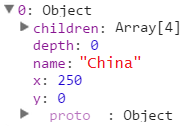
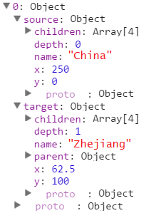
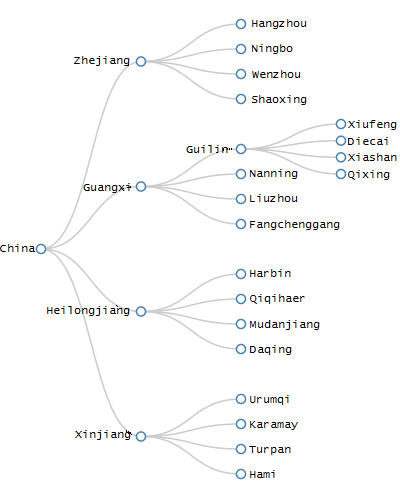

# Chapter 15 Tree

Author: Zhihua Lv

Translated by Huijun Cui 

The tree can show the including and included relationships between nodes

## Data

The initial data is written in a JSON file and can be read by D3.

JSON(JavaScript Object Notation) It is a kind of lightweight data exchange format. If you are curious about the introduction and syntax of the format, you can read the two articles: [JSON introduction](http://www.ourd3js.com/wordpress/?p=1852) and [JSON syntax](http://www.ourd3js.com/wordpress/?p=1874)。

Now we have data as follows：

```javascript
{
"name":"China",
"children":
[
    { 
      "name":"Zhejiang" , 
      "children":
      [
            {"name":"Hangzhou" },
            {"name":"Ningbo" },
            {"name":"Wenzhou" },
            {"name":"Shaoxing" }
      ] 
    },
    
    { 
        "name":"Guangxi" , 
        "children":
        [
            {
            "name":"Guilin",
            "children":
            [
                {"name":"Xiufeng"},
                {"name":"Diecai"},
                {"name":"Xiashan"},
                {"name":"Qixing"}
            ]
            },
            {"name":"Nanning"},
            {"name":"Liuzhou"},
            {"name":"Fangchenggang"}
        ] 
    },
    
    { 
        "name":"Heilongjiang",
        "children":
        [
            {"name":"Harbin"},
            {"name":"Qiqihaer"},
            {"name":"Mudanjiang"},
            {"name":"Daqing"}
        ] 
    },
    
    { 
        "name":"Xinjiang" , 
        "children":
        [
            {"name":"Urumqi"},
            {"name":"Karamay"},
            {"name":"Turpan"},
            {"name":"Hami"}
        ]
    }
]
}
```
These data indicate the inclusion relationships between 'China - Province - City'.

## Layout (data conversion)

Now we can define a cluster diagram layout:

```javascript
var tree = d3.layout.tree()
  .size([width, height-200])
  .separation(function(a, b) { return (a.parent == b.parent ? 1 : 2); });
```

And save the layout into variable tree.

size(): It sets the size, which is the coordinate range of nodes after conversion.

separation(): It sets the intervals between nodes.

Then, we convert the data:

```javascript
d3.json("city_tree.json", function(error, root) {

  var nodes = tree.nodes(root);
  var links = tree.links(nodes);
  
  console.log(nodes);
  console.log(links);

}
```

d3.json() is used to request JSON files from the server.

What shoule be paid attention to is that d3.json() cannot read local files. For example, if you put html files and json files in the same local directory, and then you open an html file, you will find you can not read it successfully. We need to build up a network server to utilize it. If you want, you can use Apache to set up a simple server (refer to [Build Apache](http://www.ourd3js.com/wordpress/?p=413)). Otherwise，it will show the following error in the browser (Chrome) console:

**XMLHttpRequest cannot load file:///D:/*******/city.json. Cross origin requests are only supported for HTTP. **

After testing, Firefox can read local files directly without building a server, but most other browsers cannot. It is recommended to build a server for testing. This is the correct approach. 

d3.json() is followed by function(error), parameter root is the data which is read in.

The following two lines of code transform data, and save transformed data into nodes and links. Then the transformed data can be outputed as the figure shown below: 

Converted node data (nodes):



Converted link data (links):



Nodes include information about child nodes of each node (children), depth, name, position (x, y), where name is also an attribute of json file.

links include the information of source and target.

## Draft

D3 has already prepared us with the draft function: d3.svg.diagonal(). This is a diagnol generator. Only if the coordinates of nodes are inputed, it can help us to generate a Bezier curve.

Now we can build a diagnol generator:

```javascript
var diagonal = d3.svg.diagonal()
    .projection(function(d) { return [d.y, d.x]; });
```

projection() is a point intertor，the default value is [ d.x , d.y ], which means keeping the original coordinates unchanged. If we write it as [ d.y , d.x ] ，which means exchanging the coordinates of x and y for arbitrary nodes inputed.

When we want to draw links, we can adopt the procedure as follows: 

```javascript
var link = svg.selectAll(".link")
      .data(links)
      .enter()
      .append("path")
      .attr("class", "link")
      .attr("d", diagonal);   //diagonal generator is utilized 
```

When we want to draw nodes, it is more recommended to use <circle> from <svg>, just as it was used in some part above. The final result is:



## Source Code

Download link：[rm95.zip](http://www.ourd3js.com/src/rm/rm95.zip)

Presentation link: [http://www.ourd3js.com/demo/rm/R-9.5/tree.html](http://www.ourd3js.com/demo/rm/R-9.5/tree.html)
