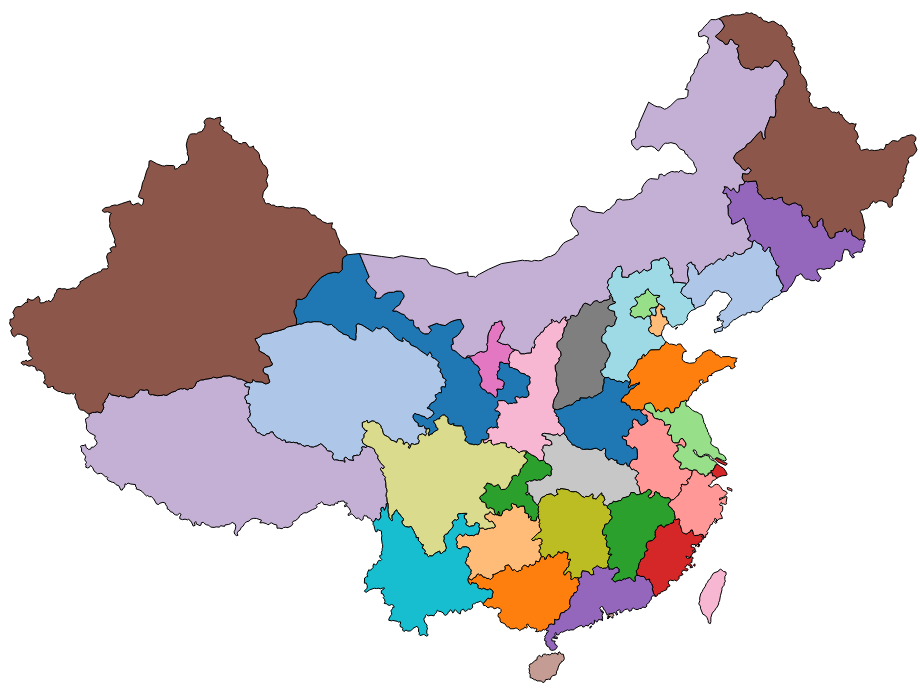

# Chapter 16 China Map

In this chapter, we will take the map of China as an example to introduce the approach to making a map. 

In data visualization, making map is an indispensible part, and lots of situations can be connected with maps. For example, the population and GDP of each province in China can be associated with the map. 

## Acquisition of map data

We need JSON files to make maps. JSON(JavaScript Object Notation) is a lightweight data exchange format. If you are interested in the syntax of JSON, can refer to [[JSON](http://www.ourd3js.com/wordpress/?cat=309)].

The JSON format files applied to geography are called as GeoJSON files. In this aricle, we will use files of this format to draw a map. 

So how could we acquire the GeoJSON files of China map? It's a little bit difficult. We can consult this link: [https://github.com/clemsos/d3-china-map](https://github.com/clemsos/d3-china-map) to make maps. This not only requires installing something, but also studying the production method. Some friends wanting to obtain GeoJSON files of China map may feel uncomfortable. And honestly I also feel unhappy about this. 

But I can share the China map I made by myself with you.

The GeoJSON file of China map: [china.geojson](http://www.ourd3js.com/demo/rm/R-10.0/china.geojson)

The original data used in the file are from [Natural Earth](http://www.naturalearthdata.com/downloads/). I extracted some data and removed a lot of useless information, and only kept the province name and id number. Here I need to express my gratitude for Natural Earth. 

Our site also provides geographical documents of other countries, and even of the county level places in China, hoping to save your valuable time. This part is really troublesome, but friends who only want to do visualization are likely not to like to do this work. Something has already been produced so far:

- [World map and main countries](http://www.ourd3js.com/wordpress/?p=668)
- [Chinese provinces and cities](http://www.ourd3js.com/wordpress/?p=638)
- [Chinese Counties](http://www.ourd3js.com/wordpress/?p=739)

Now, we can start drawing the map. 

## Projection function

```javascript
var projection = d3.geo.mercator()
    .center([107, 31])
    .scale(850)
    .translate([width/2, height/2]);
```

Because the geographic information from GeoJSON files are all longitudes and altitudes.They are all 3-dimensional information, but what should be displayed on websites are 2-dimensional, so we want to define a projection function to convert longitude information and lattitude information. As shown above, we used the peojection method 'd3.geo.mercator()'. Various projection functions can be found here: [https://github.com/mbostock/d3/wiki/Geo-Projections](https://github.com/mbostock/d3/wiki/Geo-Projections)

Line 2: center() Set the center of a map. [107,31] refer to longitude and alttitude. 

Line 3: scale() Set the magnification ratio. 

Line 4: translate() Set panning.

## Geographic Path Generator

For the purpose of generating the path value for element path in SVG on the basis of geographic data of the map, the function d3.geo.path() should be utilized, which we call it geographic path generator.

```javascript
var path = d3.geo.path()
    .projection(projection);
```

projection() is the projection function to set generator, and we can just submit the projection defined above to this function. From now on, when the generator is utilized to calculate path, it will consider about the influence of projection automatically. 

## Request a file from the server and draw a map

```javascript
d3.json("china.json", function(error, root) {
        
    if (error) 
        return console.error(error);
    console.log(root.features);
        
    svg.selectAll("path")
        .data( root.features )
        .enter()
        .append("path")
        .attr("stroke","#000")
        .attr("stroke-width",1)
        .attr("fill", function(d,i){
            return color(i);
        })
        .attr("d", path )   //Make use of geographic path generator
        .on("mouseover",function(d,i){
                    d3.select(this)
                       .attr("fill","yellow");
                })
                .on("mouseout",function(d,i){
                    d3.select(this)
                       .attr("fill",color(i));
                });
});
```

I want to declare again: d3.json() can not read local files directly, thus you need to set up a server, such as Apache. 

The next step is to add path element to svg. In this exmaple, each path represents a province. The code 'attr(“d”,path)' should be paid attention to, and it is equavalent to:

```javascript
.attr("d",funtion(d){
    return path(d);
})
```

The method of omission is very common and necessary to be grasped. 

Well, it's time to observe the result:



## Source Code

Download Link：[rm100.zip](http://www.ourd3js.com/src/rm/rm100.zip)

Presentation Link：[http://www.ourd3js.com/demo/rm/R-10.0/chinamap.html](http://www.ourd3js.com/demo/rm/R-10.0/chinamap.html)
